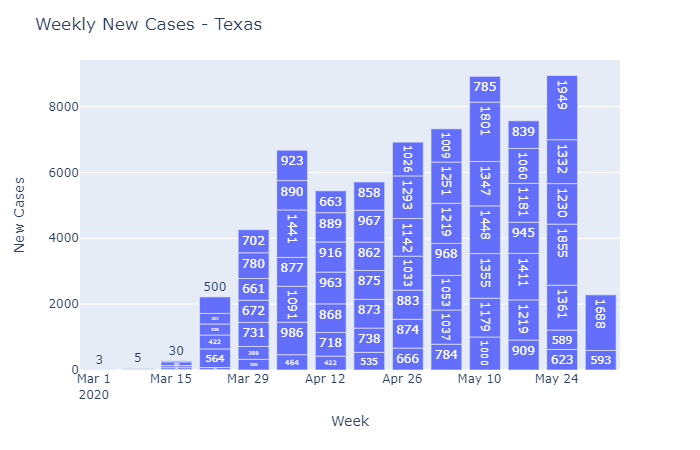
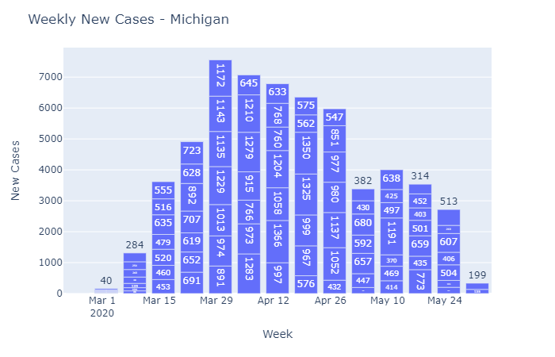

# covid-19-trends
COVID-19 trend analysis using pandas and plotly

## Weekly New Cases

## Feature Roadmap
* Add county-level details.
* Add all states in the United States to the auto-generation list.
* Add email reporting feature for daily, weekly, and monthly updates.
