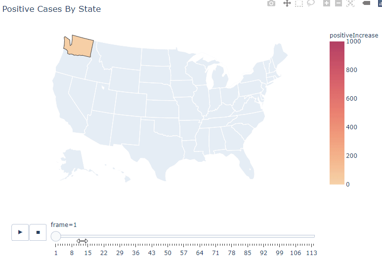
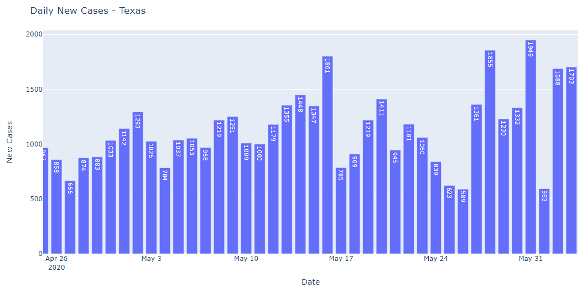

# covid-19-trends
COVID-19 trend analysis using pandas and plotly

## Example Charts

## Features
* Daily, weekly, and monthly charts of new cases for all 50 states in the United States
* Animated choropleth map of the USA outbreak

## Roadmap
* Add state-to-state comparison features.
* Improve display details on charts (show aggregate totals on roll-up charts).
* Add county-level details.
* Add proximity filter (show me new case velocity within 250 km of my current location).
* Add population normalization features (cases per capita).
* Add email reporting feature for daily, weekly, and monthly updates.
